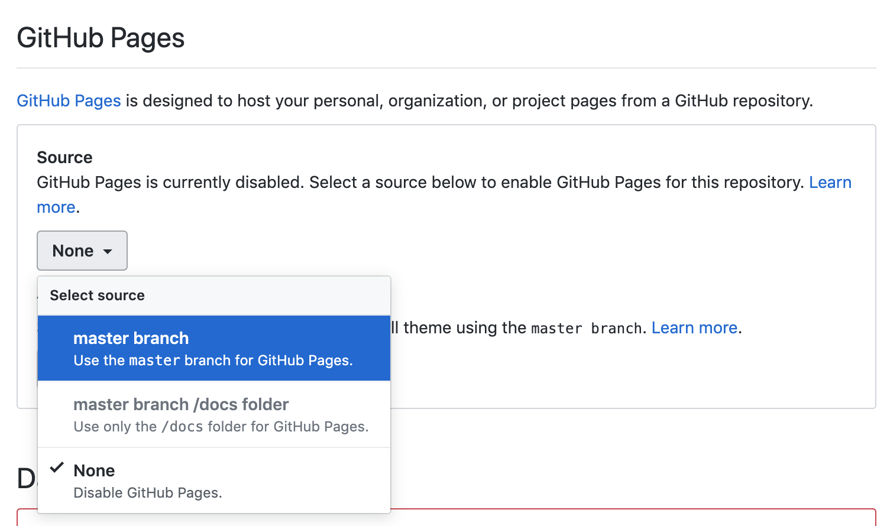

# Write your headline here

### Write your nutgraf here

Make sure your pitch answers the following questions:

- Why this story is relevant ("So what?) and why now?
- What is the single question your story tries to answer?
- Why will this story resonate with your audience?

What else has been done on this topic (provide links)? How is your angle different or fresh?

- [Related headline (NYT)](https://www.nytimes.com/2020/03/09/upshot/coronavirus-oil-prices-bond-yields-recession.html)
- [Related headline (NPR)](https://www.nytimes.com/2020/03/09/upshot/coronavirus-oil-prices-bond-yields-recession.html)
- [Related headline (WNYC)](https://www.nytimes.com/2020/03/09/upshot/coronavirus-oil-prices-bond-yields-recession.html)

Describe how and where you found the data with links to sources. Put the raw data (csv format) in a folder called `data` in this folder. Make a folder called `notebooks` where you will write your pandas code.

Write up at least one or up to three findings from your analysis based on the data you found.

- Finding 1
- Finding 2
- Finding 3

Who are some potential human sources you could reach out to for more info?

What is the maximum (best) story possible? What's the minimum (fallback) story if your hypothesis doesn't prove out?

## How to publish and submit your project

1. Make sure you have navigated to your `data-journalism` folder with your terminal first. Clone a fresh copy of this template and navigate to the folder.

   ```
   git clone git@github.com:JOUR73351/ny-warn-scraper.git
   cd ny-warn-scraper
   ```

2) Remove my git tracking from the project

   ```
   rm -rf .git
   ```

3) Create a new repository on GitHub called `ny-warn-scraper` with the following settings.
   <br>
   

4) Run these git commands to initialize the repo. Make sure you've checked `ssh`.

   ```
   git init
   git add -A
   git commit -m "first commit"
   git remote add origin git@github.com:YOUR-USERNAME-HERE/ny-warn-scraper.git
   git push -u origin master
   ```

5) Write your pitch in `README.md`.

6) Run `pipenv install` to install all of the python dependencies and run `pipenv run jupyter lab` to start Jupyter.

7) Scrape the [WARN notices](https://labor.ny.gov/app/warn) from the NY Department of Labor website and output to `data/warn.csv`. Your scraper code will live in `notebooks/scrape.ipynb`.

   Extra credit if you can scrape previous years' notices as well. Here's a clue:

   ```
   https://labor.ny.gov/app/warn/default.asp?warnYr=2019
   https://labor.ny.gov/app/warn/default.asp?warnYr=2018
   https://labor.ny.gov/app/warn/default.asp?warnYr=2017
   ...
   ```

   Can you do this in a loop?

8. Come up with some questions about the data and try to answer them with pandas functions. Analyze the data you've scraped in `notebooks/analyze.ipynb`. You will probably need to do a bit of data cleaning in pandas and convert some columns to integers. Export the data you are visualizing in a chart in the `output` folder.

9) Write your story in and add your assets and charts to `index.html`. Feel free to play around with and change the styles in `style.css`, but you are not required to. Delete the code that you don't need for your story. The story itself should be no less than 150 words and include at least one chart from Datawrapper. You can embed a Datawrapper chart in your story by copying the embed code into your html as I have done in `index.html.`
   <br>
   

10) You can preview a local version of your story by running a python server.

```
python -m SimpleHTTPServer 8000
```

Then, navigate to `http://localhost:8000` in your browser. Before step 8, you must quit the python server by pressing `ctrl+c`.

11. To save a version of your story on GitHub, run the following git commands.

```
git add -A
git commit -m "YOUR-COMMIT-MESSAGE-HERE"
git push
```

12. To publish, go to the settings of your GitHub repo, scroll down to GitHub Pages, and configure the source to the master branch.
    
